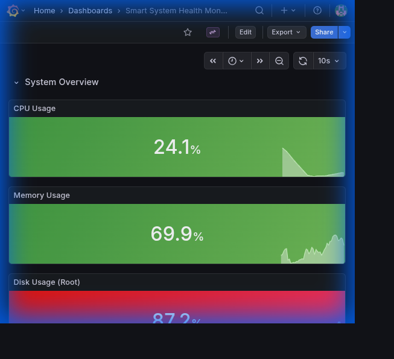

# 🎯 Smart System Health Monitor

<div align="center">

**A Production-Ready Observability Platform with Predictive Analytics**

[](https://opensource.org/licenses/MIT)
[](https://www.docker.com/)
[](https://prometheus.io/)
[](https://grafana.com/)

[Features](#-features) • [Quick Start](#-quick-start) • [Demo](#-live-demo) • [Dashboard](#-dashboard-preview) • [Alerts](#-alert-system)

</div>

---

## 📖 Overview

The **Smart System Health Monitor** is an advanced observability platform that goes beyond traditional monitoring tools by providing **predictive analytics** and **intelligent alerting**. Built with industry-standard tools (Prometheus, Node Exporter, Grafana), it demonstrates production-grade DevOps and SRE practices.

### 🎓 The Problem

Traditional monitoring tools show _what's happening now_, but don't predict _what will happen next_. System administrators often react to problems **after** they occur, leading to downtime and degraded performance.

### 💡 The Solution

This platform uses **trend-based forecasting** with Prometheus's `predict_linear()` function to:

- 🔮 Detect resource consumption patterns
- 📊 Predict future resource states **10 minutes in advance**
- 🚨 Alert **before** problems occur
- 📈 Provide actionable insights for capacity planning

### 🎬 Real-World Use Case

> **Scenario**: Overnight ML model training on a production server
>
> **Without Prediction**: System crashes at 3 AM due to memory exhaustion → Data loss → Manual intervention required
>
> **With Smart Monitor**: Alert fires at 2:50 AM predicting memory exhaustion → Automated scaling triggered → Training completes successfully

---

## ✨ Features

<table>
<tr>
<td width="50%">

### 📊 Real-Time Monitoring

- **CPU Usage** - Per-core breakdown with idle time tracking
- **Memory Usage** - Available vs. used memory analysis
- **Disk Usage** - Per-partition monitoring (excludes tmpfs/virtual)
- **System Uptime** - Continuous uptime tracking
- **Temperature** - Hardware sensors _(if supported by hardware)_
- **Battery** - Laptop battery capacity _(if available)_
- **Load Average** - 1m, 5m, 15m load indicators
- **Processes** - Running process count

> **Note**: Temperature and battery metrics are hardware-dependent. Some metrics may not be available on all Linux distributions or virtualized environments.

</td>
<td width="50%">

### 🧠 Smart Analytics

- **Composite Health Score** (0-100)
  - CPU: 40% weight
  - Memory: 40% weight
  - Disk: 20% weight
- **Predictive Forecasting**
  - 10-minute CPU saturation prediction
  - Memory exhaustion forecasting
  - Linear regression trend analysis
  - Risk level indicator
- **Intelligent Alerting**
  - Multi-tier severity levels
  - Predictive alerts (before problems occur)
  - Detailed recommendations
  - Slack/Email webhook ready

</td>
</tr>
</table>

---

## 🚀 Quick Start

### Prerequisites

- **Docker** (20.10+)
- **Docker Compose** (1.29+)
- **Linux OS** (tested on Ubuntu 20.04+)
- **4GB RAM** minimum
- **2GB free disk space**

### 🎯 One-Liner Installation

```bash
# Quick start (recommended)
./run.sh
```

**OR** skip the script and run directly:

```bash
# Direct Docker Compose start
docker compose up -d && echo "✅ Services started! Access Grafana at http://localhost:3000 (admin/admin)"
```

### Full Installation

```bash
# Clone the repository
git clone <your-repo-url>
cd smart-system-health-monitor

# Start the monitoring stack
./run.sh
```

The startup script will:

1. ✅ Check prerequisites (Docker, Docker Compose)
2. ✅ Validate configurations (Prometheus, Grafana)
3. ✅ Pull Docker images
4. ✅ Start all services
5. ✅ Display access URLs

### 🔗 Quick Access

<div align="center">

|         Service          | Access Link                                                    | Credentials       |
| :----------------------: | :------------------------------------------------------------- | :---------------- |
| 📊 **Grafana Dashboard** | [http://localhost:3000](http://localhost:3000)                 | `admin` / `admin` |
|    📈 **Prometheus**     | [http://localhost:19090](http://localhost:19090)               | -                 |
|   🖥️ **Node Exporter**   | [http://localhost:9100/metrics](http://localhost:9100/metrics) | -                 |

**🎯 Direct Dashboard**: [http://localhost:3000/d/smart-health-monitor/smart-system-health-monitor](http://localhost:3000/d/smart-health-monitor/smart-system-health-monitor)

</div>

---

## 🖼️ Dashboard Preview

### System Overview & Health Score

Real-time metrics with composite health scoring algorithm




---

## �🏗️ Architecture

```
┌─────────────────────────────────────────────────────────────────┐
│                         YOUR SYSTEM                             │
│  ┌──────────┐  ┌──────────┐  ┌──────────┐  ┌──────────┐       │
│  │   CPU    │  │  Memory  │  │   Disk   │  │  Sensors │       │
│  └────┬─────┘  └────┬─────┘  └────┬─────┘  └────┬─────┘       │
│       │             │             │             │               │
│       └─────────────┴─────────────┴─────────────┘               │
│                          │                                       │
│                          ▼                                       │
│              ┌───────────────────────┐                          │
│              │    Node Exporter      │                          │
│              │   (Port 9100)         │                          │
│              │  Exposes /metrics     │                          │
│              └───────────┬───────────┘                          │
└──────────────────────────┼──────────────────────────────────────┘
                           │
                           │ HTTP Scrape (every 10s)
                           │
                           ▼
              ┌────────────────────────┐
              │     Prometheus         │
              │   (Port 19090)         │
              │  ┌──────────────────┐  │
              │  │  Time Series DB  │  │
              │  │  Alert Engine    │  │
              │  │  PromQL Queries  │  │
              │  └──────────────────┘  │
              └────────────┬───────────┘
                           │
                           │ PromQL Queries
                           │
                           ▼
              ┌────────────────────────┐
              │       Grafana          │
              │     (Port 3000)        │
              │  ┌──────────────────┐  │
              │  │   Dashboards     │  │
              │  │   Visualizations │  │
              │  │   Alert UI       │  │
              │  └──────────────────┘  │
              └────────────────────────┘
                           │
                           ▼
                    👤 End User
```

### Component Stack

| Component         | Purpose                    | Port  | Technology       |
| ----------------- | -------------------------- | ----- | ---------------- |
| **Node Exporter** | Exposes system metrics     | 9100  | Go binary        |
| **Prometheus**    | Metrics storage & alerting | 19090 | Time-series DB   |
| **Grafana**       | Visualization & dashboards | 3000  | React/TypeScript |

---

## 📊 Dashboard Guide

The Grafana dashboard is organized into **7 comprehensive rows**:

### 1️⃣ System Overview

- Current CPU, Memory, Disk usage
- System uptime display
- Color-coded threshold indicators

### 2️⃣ Composite Health Score

- **Health Score Gauge** (0-100) with color zones:
  - 🟢 Green (0-50): Healthy
  - 🟡 Yellow (50-75): Moderate load
  - 🟠 Orange (75-90): High load
  - 🔴 Red (90-100): Critical
- **Historical Trend** - 1-hour health score history

**Formula**: `(CPU × 0.4) + (Memory × 0.4) + (Disk × 0.2)`

### 3️⃣ Resource Trends

- CPU usage by core (multi-line graph)
- Memory usage over time
- Disk I/O operations

### 4️⃣ Predictive Analytics

- **10-Minute CPU Prediction** - Current vs. predicted idle time
- **Memory Forecast** - Predicted available memory
- **Risk Indicator**: 🟢 Safe / 🟡 At Risk / 🔴 Critical

### 5️⃣ Disk & I/O

- Disk usage by partition
- Read/write operations per second

### 6️⃣ Advanced Metrics

- Load average (1m, 5m, 15m)
- Running processes count
- Temperature sensors _(if available)_
- Battery status _(if available)_

### 7️⃣ Active Alerts

- Currently firing alerts
- Alert history

---

## 🚨 Alert System

### Intelligent Alert Rules

#### 🎯 Health Score Alerts

- **HighSystemHealthScore** (Warning): Score > 75% for 2 minutes
- **CriticalSystemHealthScore** (Critical): Score > 90% for 1 minute

#### 🔮 Predictive Alerts

- **PredictedCPUOverload**: CPU idle predicted < 5% in 10 minutes
- **MemoryGrowthDetected**: Memory decreasing > 10MB/s for 5 minutes
- **PredictedMemoryExhaustion**: Available memory predicted < 1GB in 10 minutes

#### 📊 Resource Alerts

- **HighCPUUsage**: CPU > 85% for 3 minutes
- **HighMemoryUsage**: Memory > 85% for 3 minutes
- **DiskSpaceCritical**: Disk > 85% for 5 minutes

#### 🔧 Monitoring Health

- **NodeExporterDown**: Node Exporter unreachable
- **PrometheusDown**: Prometheus server offline

### Sample Alert Message

```
🚨 ALERT: PredictedCPUOverload
Severity: WARNING
Instance: localhost:9100

Summary: CPU overload predicted in 10 minutes

Description: Based on current trends, CPU idle time is predicted to drop to
3.2% in 10 minutes. Current idle: 15.4%

Impact: System may become CPU-bound soon. Response times will degrade.

Recommendation: Investigate high CPU processes using 'top' or 'htop'.
Consider scaling resources or deferring non-critical tasks.

Timestamp: 2025-12-18 08:45:00 UTC
```

### Webhook Integration (Optional)

Add Slack/Email notifications by configuring Alertmanager:

```yaml
# prometheus/alertmanager.yml (example)
route:
  receiver: "slack-notifications"

receivers:
  - name: "slack-notifications"
    slack_configs:
      - api_url: "YOUR_SLACK_WEBHOOK_URL"
        channel: "#alerts"
        title: "{{ .GroupLabels.alertname }}"
        text: "{{ range .Alerts }}{{ .Annotations.description }}{{ end }}"
```

---

## 🧪 Demo Mode

Test the predictive capabilities and alert system:

```bash
# Generate load for 5 minutes (default)
./scripts/load_generator.sh

# Generate load for custom duration (in seconds)
./scripts/load_generator.sh 600  # 10 minutes

# Stop early with Ctrl+C
```

### Expected Behavior

Within 2-5 minutes, you'll observe:

1. 📈 **Health Score** increases from green → yellow → orange
2. 📉 **Predictive graphs** show declining trends
3. 🚨 **Risk Indicator** changes from 🟢 → 🟡 → 🔴
4. 🔔 **Alerts** start firing in the Alert List panel
5. 🔮 **10-minute predictions** become visible

---

## ⚙️ Configuration

### Environment Variables

Edit `.env` file to customize:

```bash
# Grafana credentials
GRAFANA_ADMIN_USER=admin
GRAFANA_ADMIN_PASSWORD=your_secure_password
```

### Prometheus Settings

Edit `prometheus/prometheus.yml`:

```yaml
global:
  scrape_interval: 15s # Metrics collection frequency
  evaluation_interval: 15s # Alert evaluation frequency
```

### Grafana Settings

Edit `docker-compose.yml` to customize Grafana:

```yaml
environment:
  - GF_SERVER_ROOT_URL=http://localhost:3000
  - GF_INSTALL_PLUGINS= # Add plugins here
```

### Alert Thresholds

Edit `prometheus/alert_rules.yml` to customize thresholds:

```yaml
# Example: Change health score threshold
- alert: HighSystemHealthScore
  expr: |
    (health_score_calculation) > 80  # Changed from 75
  for: 2m
```

---

## 🔧 Troubleshooting

### Services Won't Start

```bash
# Check Docker is running
docker info

# View logs
docker compose logs

# Restart services
docker compose restart
```

### Dashboard Shows "No Data"

**Solution**: Already configured! The datasource UID is correctly set.

If issues persist:

1. Check Prometheus targets: http://localhost:19090/targets
2. Verify Node Exporter: http://localhost:9100/metrics
3. Test Grafana datasource: Settings → Data Sources → Prometheus → Test

### Port Conflicts

Ports are pre-configured to avoid conflicts:

- Prometheus: **19090** (external) / 9090 (internal)
- Grafana: **3000**
- Node Exporter: **9100**

> **Note**: Grafana datasource uses `http://prometheus:9090` for internal Docker network communication. This is correct!

---

## 🎓 Skills Demonstrated

### Technologies & Tools

- **Monitoring**: Prometheus, Node Exporter, Grafana
- **Query Language**: PromQL (advanced queries, predictions)
- **Containerization**: Docker, Docker Compose
- **Scripting**: Bash (automation, load testing)
- **Configuration Management**: YAML, JSON
- **Linux Administration**: System metrics, process management
- **Alerting**: Multi-tier alert rules, predictive alerts
- **Data Visualization**: Dashboard design, time-series graphs
- **Predictive Analytics**: Linear regression, trend forecasting

### Competencies

- DevOps practices and automation
- Site Reliability Engineering (SRE)
- Observability and monitoring
- Capacity planning
- Incident prevention
- Infrastructure as Code (IaC)
- Production system design

---

## 📁 Project Structure

```
smart-system-health-monitor/
├── prometheus/
│   ├── prometheus.yml          # Metrics collection config
│   └── alert_rules.yml         # 10+ intelligent alerts
├── grafana/
│   ├── dashboards/
│   │   └── system_health_dashboard.json  # 17-panel dashboard
│   └── provisioning/
│       ├── datasources/
│       │   └── datasources.yml # Auto-configured Prometheus
│       └── dashboards/
│           └── dashboards.yml  # Dashboard auto-loading
├── scripts/
│   └── load_generator.sh       # Demo load testing
├── docs/
│   └── images/                 # Dashboard screenshots
├── docker-compose.yml          # Service orchestration
├── run.sh                      # One-command startup
├── stop.sh                     # Graceful shutdown
├── README.md                   # This file
├── QUICKSTART.md              # Quick reference guide
├── ACCESS_INFO.txt            # Access URLs
└── LICENSE                    # MIT License
```

---

## 📝 Technical Details

### Technologies Used

| Category             | Technology     | Purpose                       |
| -------------------- | -------------- | ----------------------------- |
| **Monitoring**       | Prometheus     | Metrics collection & alerting |
| **Exporter**         | Node Exporter  | System metrics exposure       |
| **Visualization**    | Grafana        | Dashboards & UI               |
| **Containerization** | Docker         | Service isolation             |
| **Orchestration**    | Docker Compose | Multi-container management    |
| **Query Language**   | PromQL         | Metric queries & calculations |

### Key PromQL Queries

**CPU Usage Percentage**:

```promql
100 - (avg by(instance) (rate(node_cpu_seconds_total{mode="idle"}[5m])) * 100)
```

**Memory Usage Percentage**:

```promql
(1 - (node_memory_MemAvailable_bytes / node_memory_MemTotal_bytes)) * 100
```

**Predicted CPU Idle (10 min)**:

```promql
predict_linear(avg by(instance) (rate(node_cpu_seconds_total{mode="idle"}[5m]))[10m:15s], 600) * 100
```

**Composite Health Score**:

```promql
(cpu_usage * 0.4) + (memory_usage * 0.4) + (disk_usage * 0.2)
```

---

## 📄 License

This project is licensed under the MIT License - see the [LICENSE](LICENSE) file for details.

---

## 🤝 Contributing

Contributions are welcome! Please feel free to submit a Pull Request.

---

## 📧 Contact

For questions or feedback, please open an issue on GitHub.

---

<div align="center">

**Built with ❤️ for DevOps, SRE, and observability excellence**

_This project demonstrates production-grade monitoring practices and is suitable for portfolio showcasing, technical interviews, and real-world deployment._

[⬆ Back to Top](#-smart-system-health-monitor)

</div>
